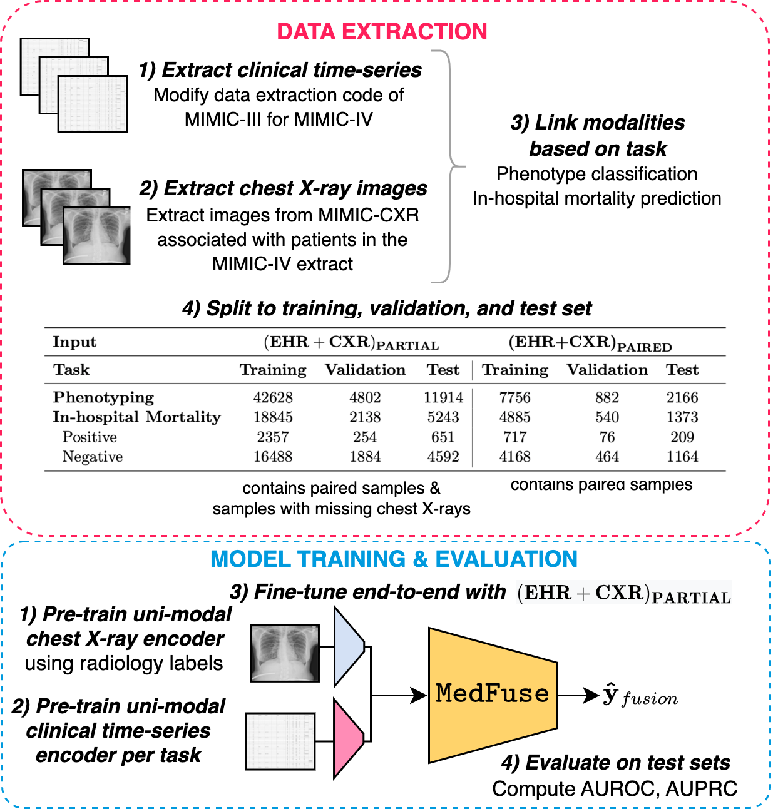

MedFuse Reprodicibility Study
=================

MedFuse re-implementation for UIUC's CS 598 DLH: Deep Learning for Healthcare

Table of Contents
=================

<!--ts-->
  <!-- * [Background](#Background) -->
  * [Overview](#Overview)
  * [Background](#Background)
  * [Environment setup](#Environment-setup)
  * [Dataset](#Dataset)
  * [Model training](#Model-training)
  * [Model evaluation](#Model-evaluation)
  * [Citation](#Citation)
<!--te-->

Background
============
The paper I have chosen to reproduce is MedFuse, a multi-modal approach to classification via clinical data and x-ray images (Hayat et al., 2022). Multi-modal learning underpins many state-of-the-art (SOTA) models, including the recently released GPT-4, which can both produce images from natural text descriptions, as well as alter given images while maintaining conversational abilities with human users (OpenAI, 2023). However, most current applications require that all modalities be present at the same time for the model to function (̈Polsterl et al., 2021). This presents a unique challenge for medical machine learning models, as clinicians are likely to either write clinical notes before administering X-Rays and other scans, or forgo these imaging solutions entirely if deemed unnecessary. Thus, most patient data is heterogeneous in nature, which interferes with the usage of existing architectures as off-the-shelf solutions.

Thus, the authors propose MedFuse, a unique architecture that is able to integrate medical data from different sources (i.e. clinical notes, chest X-Rays, etc.) without requiring all modalities to be present before inference. A challenge with developing this model is that (at the time of writing) there are no widely available multi-modal clinical datasets for benchmarking. Therefore, the authors utilize MIMIC-IV (Johnson et al., 2023) in conjunction with MIMIC-CXR (Johnson et al., 2019) to match patients with their X-Rays for multi-modal prediction on in-hospital mortality and phenotyping. This data mimics real world scenarios whereby some patients have all modalities, while others only contain clinical notes about their hospital stay.


Overview of the MedFuse network
====================================

We extract MIMIC-IV and MIMIC-CXR data based on the task (i.e. phenotyping or in-hospital mortality). Data splits, along with general statistics are shown below. We follow the same preprocessing pipeline outlined by the authors to ensure datasets remain the same.



Environment setup
==================

```
git clone https://github.com/sidmadala/MedFuse-Reproduce.git
cd MedFuse
conda env create -f medfuse.yml
conda activate medfuse
```

Dataset
-------------


We used [MIMIC-IV EHR](https://physionet.org/content/mimiciv/1.0/) and [MIMIC CXR](https://physionet.org/content/mimic-cxr-jpg/2.0.0/) for all the experiments. We follow the same outline as the original authors in generating the cleaned dataset via [script for MIMIC-IV](mimic4extract/README.md). Follow the [README](mimic4extract/README.md) to extract and prepare the time-series EHR dataset for experiments.

Please specify the ehr_data_dir and cxr_data_dir directories paths before running the scripts.


Overview of the network with MedFuse module
====================================


Model training
-----------------

For MedFuse we pre-train the modality-specific encoders in stage one, run the following scripts.

```
# train the imaging model with 14 radiology labels.
sh ./scripts/radiology/uni_cxr.sh

# train LSTM model on extracted time-series EHR data for phenotype task.
sh ./scripts/phenotyping/train/uni_all.sh

# train LSTM model for in-hospital-mortality task
sh ./scripts/mortality/train/uni_all.sh
```

In stage two we fuse and fine-tune the single-modal represetations with our proposed MedFuse approach.
Set the best model paths of the 'load_state_cxr' and 'load_state_ehr' saved from stage one and run the following script.

```
# med fuse for in hospital mortality
sh ./scripts/mortality/train/medFuse.sh

# med fuse for phenotype task
sh ./scripts/phenotyping/train/medFuse.sh
```

For training the ablation study modules, please replace the above scripts with ```early.sh```


Model evaluation
------------------
Set the 'load_state' argument to the best model checkpoint path from above experiments before running the following scripts. Also set the ```mode``` argument to ```eval``` before running evaluation scripts.

```
# med fuse for in hospital mortality
sh ./scripts/mortality/eval/medFuse.sh

# med fuse for phenotype task
sh ./scripts/phenotyping/eval/medFuse.sh
```

Citation 
============

This code reproduces the following paper's experiments:

```
@misc{https://doi.org/10.48550/arxiv.2207.07027,
  doi = {10.48550/ARXIV.2207.07027},
  url = {https://arxiv.org/abs/2207.07027},
  author = {Hayat, Nasir and Geras, Krzysztof J. and Shamout, Farah E.},
  title = {MedFuse: Multi-modal fusion with clinical time-series data and chest X-ray images},
  publisher = {arXiv},
  year = {2022},
  copyright = {Creative Commons Attribution 4.0 International}
}
```